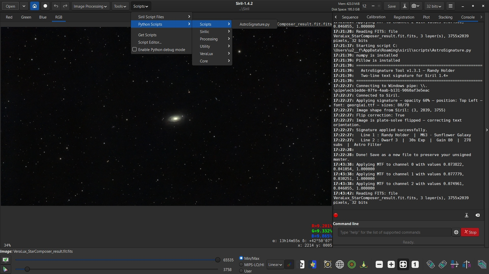
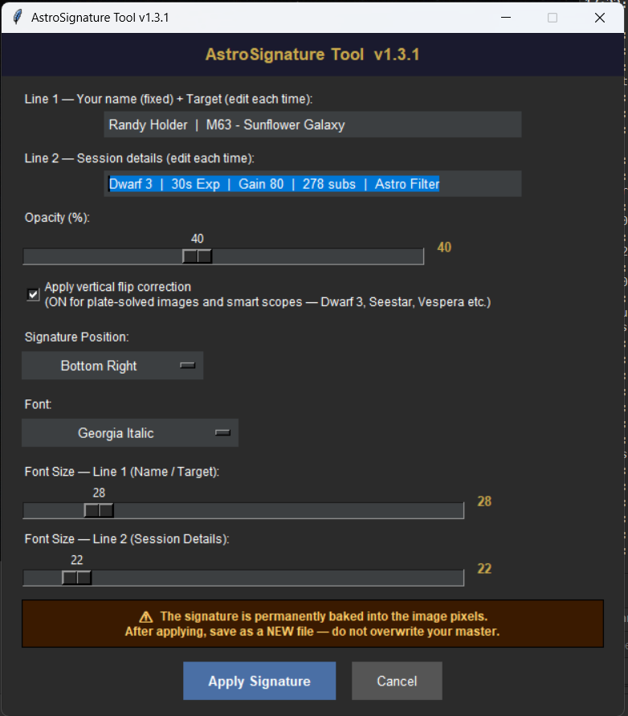
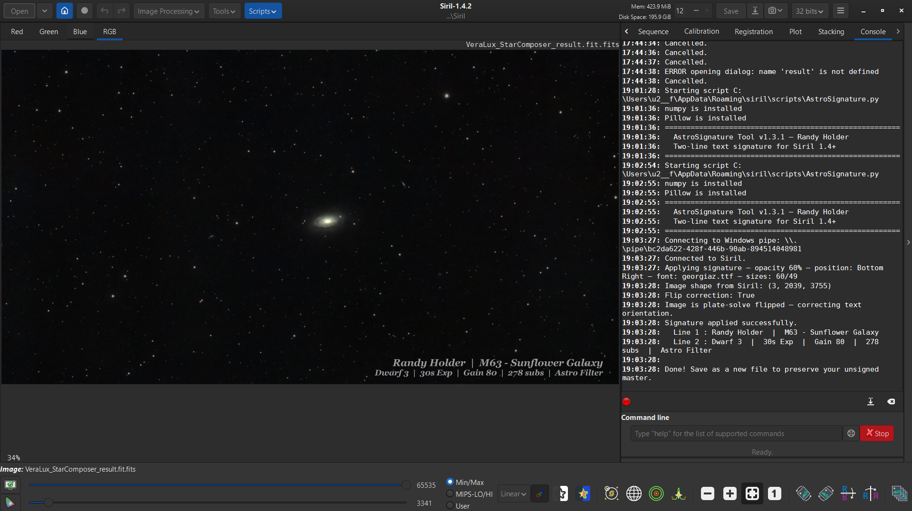

# AstroSignature

**A text-based signature tool for Siril astrophotography software**

AstroSignature is a Python script for [Siril](https://siril.org) (v1.4.2+) that adds a customizable two-line text signature directly to your astrophotography images. Unlike the existing image-based Signature_Tool, AstroSignature lets you type dynamic session-specific text each time — perfect for including your name, target object, telescope, exposure details, and filter information on every image.

---

## Features

- **Two editable text lines** — name + target on Line 1, session details on Line 2
- **9-position grid** — Top/Middle/Bottom × Left/Center/Right via dropdown
- **Font selection** — curated list of system fonts scanned automatically per OS
- **Independent font size sliders** — separate size control for Line 1 and Line 2 (12–120pt)
- **Opacity control** — 10–80% slider for subtle or bold signatures
- **Vertical flip correction** — handles plate-solved images and smart scope native orientation (Dwarf 3, Seestar, Vespera etc.)
- **Cross-platform** — Windows, macOS, Linux font detection with graceful fallback
- **Shadow effect** — subtle drop shadow for readability on any background

---

## Screenshots

---

## Requirements

- Siril 1.4.2 or later
- sirilpy >= 0.6.37 (included with Siril 1.4+)
- Python >= 3.9
- Pillow (auto-installed on first run via `sirilpy.ensure_installed`)
- numpy (auto-installed on first run)

---

## Installation

### Option 1 — Manual (All platforms)

1. Download `AstroSignature.py`
2. Place it in your Siril user scripts folder:
   - **Windows:** `C:\Users\[username]\AppData\Roaming\siril\scripts\`
   - **macOS:** `~/Library/Application Support/siril/scripts/`
   - **Linux:** `~/.local/share/siril/scripts/`
3. In Siril: **Preferences > Scripts > click the refresh button > Apply**
4. The script appears under **Scripts > Python Scripts**

### Option 2 — Windows Auto-Installer (Batch File — Windows Only)

A Windows batch file `AstroSignature_Install.bat` is included for one-click installation:

1. Download `AstroSignature_Install.bat` and save it permanently in your Downloads folder
2. Each time you download a new version of `AstroSignature.py` (or `.txt`):
   - Place it in your Downloads folder
   - Double-click `AstroSignature_Install.bat`
   - The batch file renames, installs, and cleans up automatically
3. Refresh scripts in Siril: **Preferences > Scripts > refresh > Apply**

---

## Usage

1. Open and fully process your image in Siril
2. Run: **Scripts > Python Scripts > AstroSignature**
3. In the dialog:
   - **Line 1** — edit your name and target name (e.g. `Randy Holder  |  M63 - Sunflower Galaxy`)
   - **Line 2** — enter session details (e.g. `Dwarf 3  |  30s Exp  |  Gain 80  |  278 subs  |  Astro Filter`)
   - **Opacity** — adjust slider (default 40%)
   - **Flip correction** — leave **ON** for plate-solved images and smart scope data (Dwarf 3, Seestar, Vespera etc.). Turn OFF only if your image data is correctly oriented and was not flipped by Siril
   - **Position** — choose from 9 grid positions (default: Bottom Right)
   - **Font** — select from available system fonts
   - **Font Size** — set independently for Line 1 and Line 2
4. Click **Apply Signature**

> ⚠️ **Important:** The signature is permanently written into the image pixel data. Always save the signed image as a **new file** after applying — do not overwrite your unsigned master.

---

## Flip Correction Explained

Siril flips images vertically during plate solving to correct their orientation. Smart telescopes (Dwarf 3, Seestar, Vespera) also output data that is natively vertically flipped. AstroSignature's flip correction accounts for this so the signature appears correctly positioned and oriented regardless of the image's internal data orientation.

| Image Type | Flip Correction Setting |
|---|---|
| Plate-solved in Siril | ✅ ON |
| Dwarf 3, Seestar, Vespera | ✅ ON |
| Not plate-solved, correctly oriented | ❌ OFF |
| Unsure | Try ON first |

---

## Supported Fonts

AstroSignature automatically scans your system for available fonts and displays only those that are actually installed. Fonts vary by OS:

- **Windows** — Georgia, Times New Roman, Palatino, Calibri, Cambria, Arial, Verdana, Trebuchet, and more (italic and bold-italic variants)
- **macOS** — Georgia, Times New Roman, Baskerville, Didot, Palatino, Garamond, Helvetica, Arial, Verdana, Futura, Optima
- **Linux** — DejaVu, Liberation, FreeSerif, Ubuntu, Noto font families

If no system fonts are found, falls back to Pillow's built-in default font.

---

## Version History

| Version | Changes |
|---|---|
| 1.0.0 | Initial release — two-line text signature with vertical flip correction |
| 1.1.0 | Added 9-position grid selector (dropdown) |
| 1.2.0 | Added font selection dropdown from available system fonts |
| 1.3.0 | Added independent font size sliders for Line 1 and Line 2. QA verified across all 9 positions and both flip states |
| 1.3.1 | Cross-platform font support — Windows, macOS, Linux |

---

## Known Limitations

- Font availability depends on what is installed on your system — the dropdown shows only detected fonts
- The signature is destructive (baked into pixel data) — always save as a new file
- Tested primarily on Windows with Siril 1.4.2. macOS and Linux font detection is included but not yet tested on physical hardware — feedback welcome

---

## Planned Enhancements

- Additional QA testing on macOS and Linux
- Further font style refinements
- Community feedback integration

---

## License

Copyright (C) 2026 Randy Holder  
Licensed under the [GNU General Public License v3.0 or later](https://www.gnu.org/licenses/gpl-3.0.html)

---

## Contact & Bug Reports

**Author:** Randy Holder  
**Email:** randy.holder7@gmail.com  

Bug reports, feature requests and feedback are welcome via GitHub Issues.

---

## Acknowledgements

- [Siril](https://siril.org) — the excellent open-source astrophotography processing software this script is built for
- The Siril development team for the sirilpy Python API
- The astrophotography community for inspiration and testing feedback
